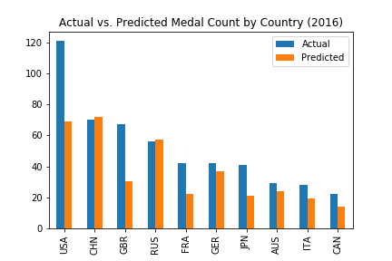
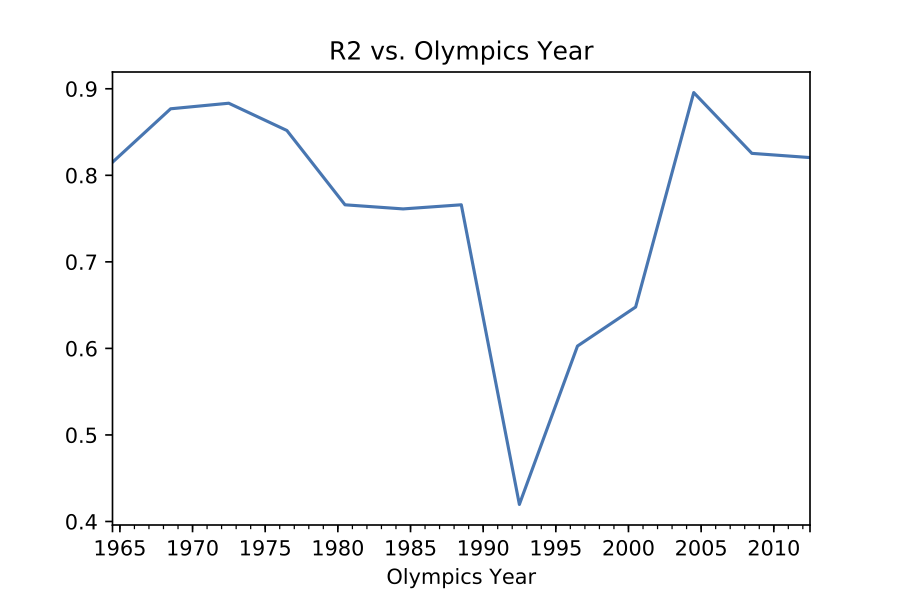
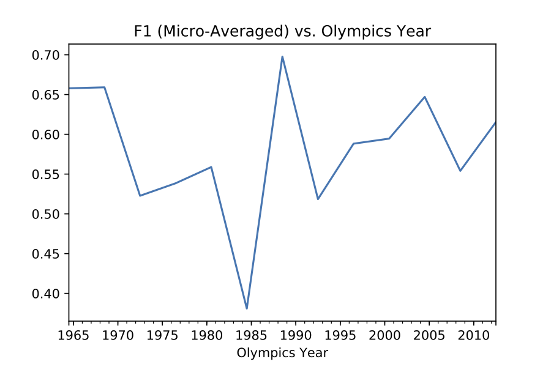
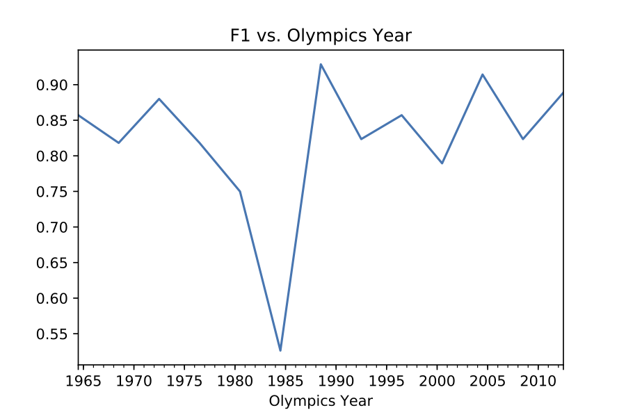

# Investigating Medals at the Olympic Games using Featuretools
##### [Goals](#goals) | [Installation](#installation) | [Featuretools Basics](#featuretools-basics-featuretoolspredictivemodelingipynb) | [Baselines using Featuretools](#baselines-using-featuretools-baselinesolutionipynb) | [Results](#overview-of-results)

<!--| [Generating Labels](##[Coming soon] Generating Labels (Prediction Engineering))
| [Deeper Exploration](#[Coming soon] Deeper Exploration)
| [Linking Multiple Datasets](#[Coming soon] Linking Multiple Datasets)
| [Performance Evaluation](#[Coming soon] Performance Evaluation)
| [Constrained Feature Exploration](#[Coming soon] Constrained Feature Exploration)
-->

## Goals
[Featuretools](https://www.featuretools.com/) is a framework to perform automated feature engineering. It excels at transforming transactional and relational datasets into feature matrices for machine learning.

The notebooks here show how Featuretools:
 * [Simplifies](BaselineSolution.ipynb) data science-related code
 * Enables us to ask [innovative](FeaturetoolsPredictiveModeling.ipynb) questions 
 * Avoids classic [label-leakage](FeaturetoolsPredictiveModeling.ipynb) problems 
 * Exhaustively generates hundreds of [features](FeaturetoolsPredictiveModeling.ipynb) 

We do so by investigating the medals won by each country at each historical Olympic Games (dataset pulled from [Kaggle](https://www.kaggle.com/the-guardian/olympic-games)). The dataset contains each medal won at each Olympic Games, including the medaling athlete, their gender, and their country and sport. 

I'll generate a model using Featuretools that predicts the number of medals a country will win at the next Olympics, compare it to 2 baseline solutions without Featuretools, and provide analysis of various predictive factors. While it's possible to have some predictive accuracy without machine learning, feature engineering is necessary to improve the score.

## Installation

```sh
pip install -r requirements.txt
```

The Olympic Games dataset is found <a href=https://www.kaggle.com/the-guardian/olympic-games/data>here</a>. Copy the three csv files into the `data/olympic_games_data` directory

<!--Notebooks 4, 5 and 6 will require the following additional datasets:-->

<!-- * <a href=https://www.kaggle.com/worldbank/world-development-indicators>Economic Data</a> -->
<!-- * <a href=https://unstats.un.org/unsd/methodology/m49/overview/>Region Data</a> -->


## Detailed Description of Notebooks

#### Featuretools Basics: FeaturetoolsPredictiveModeling.ipynb

In this notebook, I'll explain how to use out-of-the-box methods from Featuretools to transform the raw Olympics dataset into a machine-learning-ready feature matrix.
Along the way, I'll build some machine learning models, explore which features were the most predictive, and make some interesting predictions.

#### Baselines using Featuretools: BaselineSolution.ipynb

Machine learning performance scores should never be taken at face value.
To have any merit, they must be compared against a simple baseline model to see how much improvement they produced.
In this notebook, I'll examine several baseline solutions, and see how much simpler the code to produce these baselines is when using Featuretools as compared to lower-level libraries.

## Overview of Results
This is how we stack up in 2016 (the dataset included data from 1896-2012):

The model is surprisingly good, even with the simple baseline features I constructed. Check out the following scores over time:

**Regression model**


**Binned model**


**Binary model**


Notice how much worse we do in some years! We can easily see the impact of various world affairs that happened outside of this dataset, such as the Cold War boycotts in the 1980s.

Here are 2 confusion matrices from 1984 and 2004, showing how much worse we are at predicting medals in 2004.


<!--
#### [To Be Released] Generating Labels (Prediction Engineering)

I'll show a way to generate the labels for supervised machine learning we use throughout this demo.
Note that this is a non-trivial problem in general, as we need to scan through the time-varying components of a dataset and choose windows of time in which we compute a function that then determines a label.
This process is called *Prediction Engineering*, and is a core component of the paid platform of Feature Labs (the company I work for that maintains Featuretools). The open-source Featuretools does not come with built-in ways to do prediction engineering.

These labels define our goal, in this case to predict the number of medals a country will win at the next Olympics.
There are many other possible goals we could have had in mind. We could have built models to predict the number of medals an athlete will win over his or her career,
or the location of the next Olympic Games, or the sport with the highest number of competing athletes.
We stick with a single problem, which lends itself to enough complexity to make for an interesting demo. A good way to sharpen your data science skills would be to try out one of these other problems yourself.

#### [Coming soon] Deeper Exploration

Now that we understand the dataset and the basics of Featuretools, we'll take a deeper dive into some more advanced aspects of Featuretools.
Through this process we'll examine where our prediction model breaks down, as well as seek to understand the dataset from a predictive perspective.

#### [Coming soon] Linking Multiple Datasets

Linking several independently-sourced datasets is an interesting component of the data science process that Featuretools can help with.
In this notebook we'll show how to add in economic and region information about each country to our dataset, and easily rerun our pipeline with this new data.

#### [Coming soon] Performance Evaluation

At this point we've seen several different approaches to understanding the data.
In this notebook, we'll examine some unique feature selection techniques that Featuretools makes possible, as well as make some comparisons between many different models by examining their predictive power.

#### [Coming soon] Constrained Feature Exploration

The prediction problem we've defined is fairly easy to solve. What this means is that we can experiment with limited sets of features, which each hold predictive power independently from each other.
Using a limited feature set allows us to make good comparisons between different types of features.
For instance, we'll investigate how using only economic features shows us which economic indicators are most important (at least for determining the outcome of the Olympics) at different times in history.
-->
